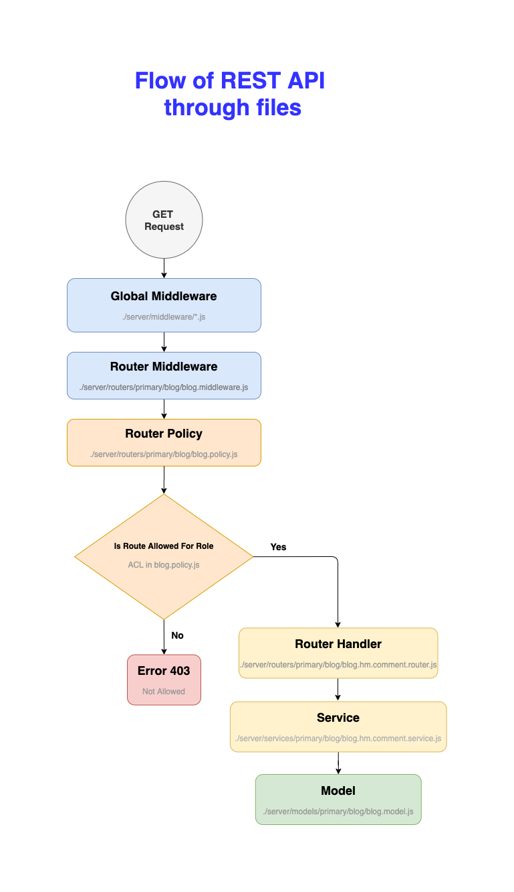
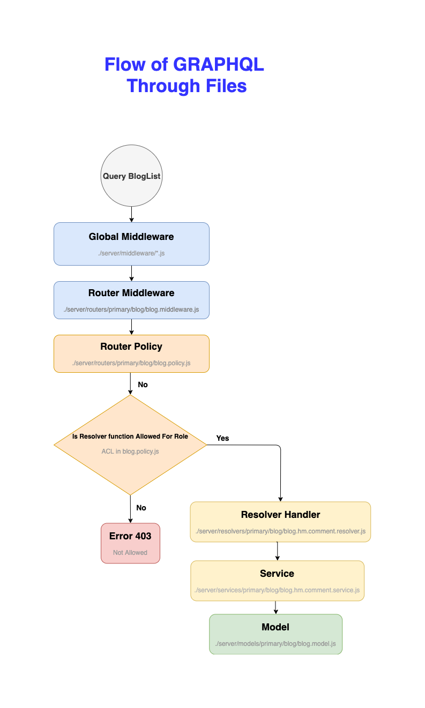

# Access control - rest

Access control works  at two levels

- Permissions - Simple read/write permissions for user defined roles
    - See the usage and examples below
- ACL - Url permissions for user defined roles and HTTP request type
     - We use `acl` package please refer https://www.npmjs.com/package/acl


## Permission set - cli

CLI Command

```
xc permissions.set <model_name> <user_type> <permission=value>
# or
xc ps <model_nmae> <user_type> <permission=value>
```

- *model_name* - Name  of the model you want to set permissions, can be multiple model names separated by `.`. Wildcard `$` would be apply to all the models.
- *user_type* - User type to update. Wildcard `$` would be apply to all the user types.
- *permissions* - Permissions can be multiple by default it will uses value as `1`, To use specific value use `=` followed by the value.

*Example 1 :*

```
$ xc permissions.set $ guest write=0
Setting Permissions for model:actor user:guest write=0
Setting Permissions for model:address user:guest write=0
Setting Permissions for model:category user:guest write=0
Setting Permissions for model:city user:guest write=0
Setting Permissions for model:country user:guest write=0
Setting Permissions for model:customer user:guest write=0
Setting Permissions for model:film_actor user:guest write=0
Setting Permissions for model:film_category user:guest write=0
Setting Permissions for model:film_text user:guest write=0
Setting Permissions for model:film user:guest write=0
Setting Permissions for model:inventory user:guest write=0
Setting Permissions for model:language user:guest write=0
Setting Permissions for model:payment user:guest write=0
Setting Permissions for model:rental user:guest write=0
Setting Permissions for model:staff user:guest write=0
Setting Permissions for model:store user:guest write=0
```

*Example 2 : with multiple model names*

```
$ xc permissions.set city.country guest write=0
Setting Permissions for model:city user:guest write=0
Setting Permissions for model:country user:guest write=0
```

*Example 3 : with multiple user types*

```
$ xc permissions.set city guest.user write=0
Setting Permissions for model:city user:guest write=0
Setting Permissions for model:city user:user write=0
```
*Example 4 : with multiple permissions*

```
$ xc permissions.set  permissions.set city guest write=0 read=1
Setting Permissions for model:city user:guest write=0
Setting Permissions for model:city user:guest read=1
```

## Permission get - cli

CLI Command

```
xc permissions.get <model_name>
# or
xc pg <model_name>
```

- *model_name* - Name  of the model you want to get permissions.

*Example :*

```
$ xc permissions.get city
Model : city 
{
  "user": {
    "read": 1,
    "write": 1
  },
  "admin": {
    "read": 1,
    "write": 1
  },
  "guest": {
    "read": 1,
    "write": 0
  }
} 
```

## Explained with examples with policy.js and api output snapshot


Initial value of `city.policy.js`


```
{
  "user": {
    "read": 1,
    "write": 1
  },
  "admin": {
    "read": 1,
    "write": 1
  },
  "guest": {
    "read": 1,
    "write": 1
  }
} 
```

After executing `xc permissions.set city guest write=0` (blocking write access to guest user)

```
{
  "user": {
    "read": 1,
    "write": 1
  },
  "admin": {
    "read": 1,
    "write": 1
  },
  "guest": {
    "read": 1,
    "write": 0
  }
} 
```

## Access  control workflow - REST API


# Access control - graphql


## Permission set - cli

CLI Command

```
xc permissions.set <model_name> <user_type> <permission_or_resolver_name=value>
# or
xc ps <model_nmae> <user_type> <permission_or_resolver_name=value>
```

- *model_name* - Name  of the model you want to set permissions, can be multiple model names separated by `.`. Wildcard `$` would be apply to all the models.
- *user_type* - User type to update. Wildcard `$` would be apply to all the user types.
- *permission_or_resolver_name* - Permission/Resolver name can be multiple by default it will uses value as `1`, To use specific value use `=` followed by the value.

*Example :*

```
$ xc permissions.set city $ CityList=1
Setting Permissions for model:city user:user CityList=1
Setting Permissions for model:city user:admin CityList=1
Setting Permissions for model:city user:guest CityList=1
```

## Permission get - cli

CLI Command

```
xc permissions.get 
# or
xc pg
```

- *model_name* - Name  of the model you want to get permissions.

*Example :*

```
$ xc permissions.get city
Model : city 
{
  "user": {
    "read": 1,
    "write": 1
  },
  "admin": {
    "read": 1,
    "write": 1
  },
  "guest": {
    "read": 1,
    "write": 0
  }
} 
```

## Explained with examples with policy.js and api output snapshot


Initial value of `city.policy.js`


```
{
  "user": {
    "read": 1,
    "write": 1
  },
  "admin": {
    "read": 1,
    "write": 1
  },
  "guest": {
    "read": 1,
    "write": 1
  }
} 
```

After executing `xc permissions.set city guest CityList=0` (blocking CityList query access for guest user)

```
{
  "user": {
    "read": 1,
    "write": 1
  },
  "admin": {
    "read": 1,
    "write": 1
  },
  "guest": {
    "read": 1,
    "write": 1,
    "CityList": 0
  }
} 
```

## Access control workflow - GraphQL API





# Access control - rest/graphql


## User add

CLI Command

```
xc permissions.user.add <user_type>
# or
xc pua <user_type>
```

- *user_type* - new user type name.

*Example :*

```
$ xc  permissions.user.add testUser
     Adding new user permission for model:actor user:testUser
     Adding new user permission for model:address user:testUser
     Adding new user permission for model:category user:testUser
     Adding new user permission for model:city user:testUser
     Adding new user permission for model:country user:testUser
     Adding new user permission for model:customer user:testUser
     Adding new user permission for model:film_actor user:testUser
     Adding new user permission for model:film_category user:testUser
     Adding new user permission for model:film_text user:testUser
     Adding new user permission for model:film user:testUser
     Adding new user permission for model:inventory user:testUser
     Adding new user permission for model:language user:testUser
     Adding new user permission for model:payment user:testUser
     Adding new user permission for model:rental user:testUser
     Adding new user permission for model:staff user:testUser
     Adding new user permission for model:store user:testUser
     Adding new user permission for model:users user:testUser
```


## User rename

CLI Command

```
xc permissions.user.rename <old_user_type> <new_user_type>
# or
xc pur <old_user_type> <new_user_type>
```

- *old_user_type* - old user type name.
- *new_user_type* - new user type name.

*Example :*

```
$ xc  permissions.user.rename testUser newUser
      Renaming user permission testUser to newUser for model:actor
      Renaming user permission testUser to newUser for model:address
      Renaming user permission testUser to newUser for model:category
      Renaming user permission testUser to newUser for model:city
      Renaming user permission testUser to newUser for model:country
      Renaming user permission testUser to newUser for model:customer
      Renaming user permission testUser to newUser for model:film_actor
      Renaming user permission testUser to newUser for model:film_category
      Renaming user permission testUser to newUser for model:film_text
      Renaming user permission testUser to newUser for model:film
      Renaming user permission testUser to newUser for model:inventory
      Renaming user permission testUser to newUser for model:language
      Renaming user permission testUser to newUser for model:payment
      Renaming user permission testUser to newUser for model:rental
      Renaming user permission testUser to newUser for model:staff
      Renaming user permission testUser to newUser for model:store
      Renaming user permission testUser to newUser for model:users
```

## User rename

CLI Command

```
xc permissions.user.delete <user_type>
# or
xc pud <user_type>
```

- *user_type* - name of the user type to delete.

*Example :*

```
$ xc  permissions.user.delete newUser
      Deleting user permission for model:actor user:newUser
      Deleting user permission for model:address user:newUser
      Deleting user permission for model:category user:newUser
      Deleting user permission for model:city user:newUser
      Deleting user permission for model:country user:newUser
      Deleting user permission for model:customer user:newUser
      Deleting user permission for model:film_actor user:newUser
      Deleting user permission for model:film_category user:newUser
      Deleting user permission for model:film_text user:newUser
      Deleting user permission for model:film user:newUser
      Deleting user permission for model:inventory user:newUser
      Deleting user permission for model:language user:newUser
      Deleting user permission for model:payment user:newUser
      Deleting user permission for model:rental user:newUser
      Deleting user permission for model:staff user:newUser
      Deleting user permission for model:store user:newUser
      Deleting user permission for model:users user:newUser
```


